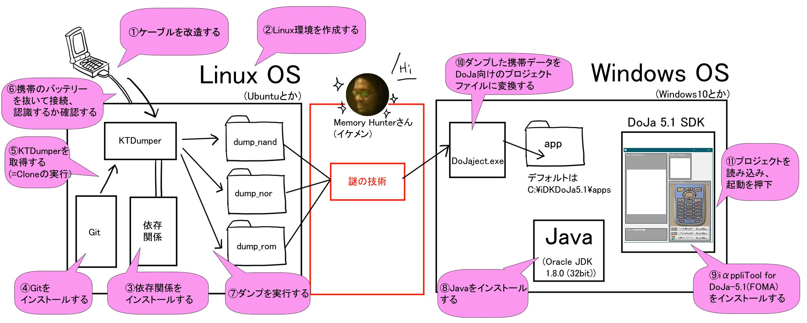

# `ktdumper`

`ktdumper` is a tool to dump memory contents of Japanese feature phones / `ktdumper` は日本の携帯電話のメモリダンプを取得するためのツールです。

## Table of Contents / 目次

- [`ktdumper`](#ktdumper)
  - [Table of Contents / 目次](#table-of-contents--目次)
  - [English](#english)
    - [Dependencies](#dependencies)
    - [Usage](#usage)
  - [Japanese](#japanese)
    - [依存関係](#依存関係)
    - [使い方](#使い方)
  - [Supported devices / 対応機種](#supported-devices--対応機種)
  - [Process Illustration / 処理の流れ](#process-illustration--処理の流れ)

## English

### Dependencies

On Ubuntu you can install the dependencies with:

```
sudo apt install python3-usb python3-tqdm gcc-arm-none-eabi
```

### Usage

Run `./ktdumper.sh` to show the list of supported devices. Afterwards, run the script with two arguments being the name of the device and the payload to execute. You may need to use "sudo" so that the script can access all USB devices. For example:

```
sudo ./ktdumper.sh p321ab dump_nor
sudo ./ktdumper.sh p321ab dump_nand
```

## Japanese

### 依存関係

Ubuntuであれば以下のコマンドで依存関係をインストールできます。

```sh
sudo apt install python3-usb python3-tqdm gcc-arm-none-eabi
```

### 使い方

`./ktdumper.sh`を実行すると対応している機種の一覧が表示されます。その後、デバイス名と実行するペイロードを引数に指定してスクリプトを実行します。全てのUSBデバイスにアクセスできるようにするために"sudo"を使う必要があるかもしれません。例えば:

```sh
sudo ./ktdumper.sh p321ab dump_nor
sudo ./ktdumper.sh p321ab dump_nand
```

## Supported devices / 対応機種

| Device name | Vendor ID | Product ID | Payloads |
| :---        |    :----:   |          ---: |          ---: |
| n900i       | 0x0409    | 0x0112    | dump_nor, dump_nand |
| n900is      | 0x0409    | 0x0121    | dump_nor, dump_nand |
| p900i       | 0x0a3c    | 0x000d    | dump_nor, dump_nand |
| p900iv      | 0x0a3c    | 0x000d    | dump_nor, dump_nand |
| n701i       | 0x0409    | 0x0142    | dump_nor, dump_nand |
| p851i       | 0x0a3c    | 0x000d    | dump_nor, dump_nand |
| n901is      | 0x0409    | 0x0144    | dump_nor, dump_nand |
| p901is      | 0x0a3c    | 0x000d    | dump_rom, dump_nor, dump_nand |
| p702i       | 0x0a3c    | 0x000d    | dump_rom, dump_nor, dump_nand |
| p902i       | 0x0a3c    | 0x000d    | dump_rom, dump_nor, dump_nand |
| p903i       | 0x0a3c    | 0x000d    | dump_nor, dump_nand |
| p704i       | 0x0a3c    | 0x000d    | dump_nor, dump_nand |
| n-01a       | 0x0409    | 0x0240    | dump_nor, dump_nand |
| n-02a       | 0x0409    | 0x025c    | dump_nor, dump_nand, nand_id |
| n-06a       | 0x0409    | 0x0274    | dump_nor, dump_nand |
| n-08a       | 0x0409    | 0x026c    | dump_nor, dump_nand |
| n-03b       | 0x0409    | 0x02a0    | dump_nor, dump_nand |
| p-01a       | 0x04da    | 0x216b    | dump_rom |
| p-03a       | 0x04da    | 0x216b    | dump_rom |
| p-04a       | 0x04da    | 0x216b    | dump_nor, dump_nand, onenand_id |
| p-10a       | 0x04da    | 0x216b    | dump_nor, dump_nand, onenand_id |
| p-01b       | 0x04da    | 0x216b    | dump_rom, dump_nand_1, dump_nand_2 |
| p-02b       | 0x04da    | 0x216b    | dump_rom, dump_nand_1, dump_nand_2 |
| p-03b       | 0x04da    | 0x216b    | dump_rom, dump_nand_1, dump_nand_2 |
| p-04b       | 0x04da    | 0x216b    | dump_rom |
| p-07b       | 0x04da    | 0x216b    | dump_rom, dump_nand |
| p-06c       | 0x04da    | 0x216b    | dump_rom, dump_nand_peek_poke, dump_nand, onenand_id |
| p-01f       | 0x04da    | 0x216b    | dump_rom, dump_emmc |
| p-01g       | 0x04da    | 0x216b    | dump_rom, dump_emmc |
| p-01h       | 0x04da    | 0x216b    | dump_rom, dump_emmc |
| 942p        | 0x04da    | 0x216b    | dump_rom, dump_nand_1, dump_nand_2 |
| 301p        | 0x04da    | 0x216b    | dump_rom, dump_emmc |
| 930ca       | 0x1967    | 0x2004    | dump_nor, dump_nand |
| sh-07f      | 0x04dd    | 0x9464    | jump_symbian |

## Process Illustration / 処理の流れ



Thanks to [Siitake Aji](https://twitter.com/siitake_aji) for the illustration.